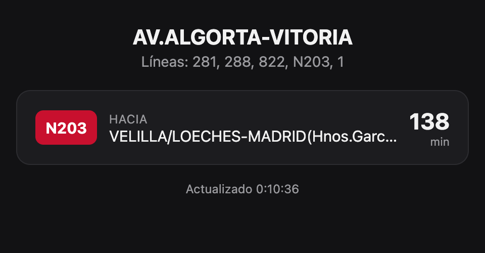

# next-bus

A small dashboard showing live next-bus arrival times for a CRTM (Consorcio Regional de Transportes de Madrid) stop.



## How it works

CRTM's real-time arrivals aren't exposed through a documented public API, but the
[crtm.es/widgets](https://www.crtm.es/widgets/) live-arrivals map calls a plain JSON backend under the hood. This
project proxies that endpoint through a small Express server (it has no CORS headers, so it can't be called directly
from the browser) and renders the results as a simple, auto-refreshing dashboard.

## Running it

```bash
npm install
npm start
```

Then open `http://localhost:3000`.

By default it shows stop `8_11550` (AV.ALGORTA-VITORIA, San Fernando de Henares). Point it at a different stop with
the `STOP_CODE` environment variable:

```bash
STOP_CODE=8_11549 npm start
```

Stop codes follow the pattern `{codMode}_{shortCodStop}` as used by the CRTM widget (`8` = interurban bus, `6` =
Madrid urban bus). You can look one up by searching `https://www.crtm.es/widgets/api/GetStops.php?customSearch=<name>`.
